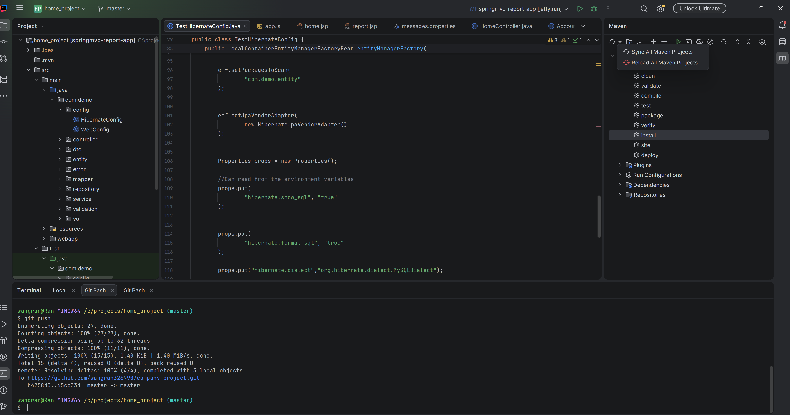
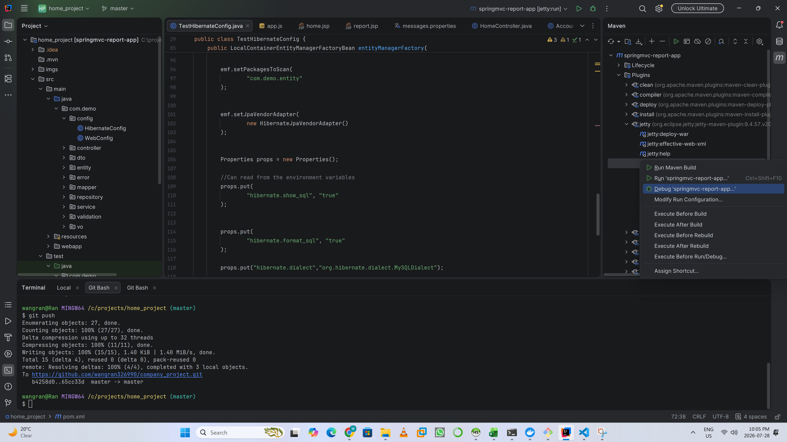

# Report App

A lightweight web application for generating reports from game transaction records.

## Tech Stack

- Java 8
- Maven 3.8+
- Spring MVC
- Hibernate / JPA
- MySQL 8
- JSP
- JUnit 5
- Mockito
- Docker (optional)

---

## Prerequisites

Before running this project, make sure the following software is installed:

- Java 8+
- Maven 3.8+
- MySQL 8
- Git

> **Note:** If Docker is installed, Java, Maven, and MySQL do not need to be installed locally.

---

# Clone Project

## Install Git

Download and install Git:

https://git-scm.com/install/windows

Verify the installation:

```bash
git --version
```

Example output:

```text
git version 2.41.0.windows.1
```

Clone the repository:

```bash
git clone https://github.com/wangran326990/company_project.git
```

---

# Quick Setup (Docker)

This project provides a Docker Compose configuration to quickly start the application with MySQL.

Before starting:

- Make sure ports `8080` and `3306` are not used by other applications.
- Install Docker Desktop.

## Install Docker Desktop

Download Docker Desktop:

https://www.docker.com/products/docker-desktop/

Installation guides:

- Windows:
  https://docs.docker.com/desktop/setup/install/windows-install/

- Mac:
  https://docs.docker.com/desktop/setup/install/mac-install/

Verify Docker installation:

```bash
docker -v
```

Example:

```text
Docker version 28.5.2, build ecc6942
```

Verify Docker Compose:

```bash
docker-compose -v
```

Example:

```text
Docker Compose version v2.40.3-desktop.1
```

## Run Application

Clone the project:

```bash
git clone https://github.com/wangran326990/company_project.git
```

Go to the project directory:

```bash
cd company_project
```

Start the application:

```bash
docker compose up -d
```

Example output:

```text
[+] Running 2/2
✔ Container mysql8                       Healthy
✔ Container transaction-report-app       Started
```

Open your browser:

```
http://localhost:8080
```

---

# Development Environment Setup

This section explains how to configure the local development environment.

---

## Java Setup

1. Download Java 8:

https://www.oracle.com/asean/java/technologies/javase/javase8-archive-downloads.html

2. Install Java.

3. Add Java to the system PATH.

Installation guide:

https://docs.oracle.com/cd/F74770_01/English/Installing/p6_eppm_install_config/89522.htm

Verify installation:

```bash
java -version
```

Example output:

```text
openjdk version "1.8.0_502"
OpenJDK Runtime Environment Corretto-8.502.07.1 (build 1.8.0_502-b07)
OpenJDK 64-Bit Server VM Corretto-8.502.07.1 (build 25.502-b07, mixed mode)
```

---

## Maven Setup

1. Download Maven:

https://maven.apache.org/docs/3.8.8/release-notes.html

2. Extract Maven and configure environment variables.

Installation guide:

https://maven.apache.org/install.html

Verify installation:

```bash
mvn -version
```

---

# MySQL Setup (Optional)

> This step is optional. You can use the MySQL Docker container instead.

## Install MySQL 8

Download MySQL:

https://www.mysql.com/downloads/

Make sure port `3306` is available.

### Windows

```cmd
netstat -ano | findstr :3306
```

### Mac

```bash
sudo lsof -i tcp:3306
```

Install MySQL:

- Windows:
  https://dev.mysql.com/downloads/installer/

- Mac:
  https://dev.mysql.com/doc/refman/8.4/en/macos-installation.html

## Database Credentials

The default database configuration uses:

```
username: root
password: root
```

If different credentials are used, update the following files:

- `TestHibernateConfig.java`

```
src/test/java/com/demo/config/TestHibernateConfig.java
```

- `HibernateConfig.java`

```
src/main/java/com/demo/config/HibernateConfig.java
```

- `pom.xml`

---

# Docker MySQL Setup

If only MySQL is required through Docker, create a `docker-compose.yml` file:

```yaml
services:
  db:
    image: mysql:8.0
    container_name: mysql8
    restart: always
    command: --default-authentication-plugin=mysql_native_password

    environment:
      MYSQL_ROOT_HOST: "%"
      MYSQL_ROOT_PASSWORD: root
      MYSQL_DATABASE: demo

    ports:
      - "3306:3306"

    healthcheck:
      test:
        [
          "CMD",
          "mysqladmin",
          "ping",
          "-h",
          "localhost",
          "-uroot",
          "-proot"
        ]
      interval: 10s
      timeout: 5s
      retries: 5

    volumes:
      - mysql_company_data:/var/lib/mysql

volumes:
  mysql_company_data:
```

Start MySQL:

```bash
docker compose up -d
```

---

# Import Test Data

1. Open a MySQL client application.
2. Execute the SQL script: [here](https://github.com/wangran326990/company_project/blob/master/src/test/resources/sql/create-database.sql).

```
src/test/resources/sql/create-database.sql
```

3. Run the SQL script to create the database and test data.

---

# Run Application Without Docker

Clone the project:

```bash
git clone https://github.com/wangran326990/company_project.git
```

Navigate to the project folder:

```bash
cd company_project
```

Start the application:

```bash
mvn jetty:run
```

Successful startup example:

```text
[INFO] Started ServerConnector@2acbe46d{HTTP/1.1, (http/1.1)}{0.0.0.0:8080}
[INFO] Started @9357ms
[INFO] Started Jetty Server
```

Open:

```
http://localhost:8080
```

---

# Debug Project Using IntelliJ IDEA

1. Install IntelliJ IDEA.

2. Open the project.

3. Synchronize Maven dependencies.



4. Open Maven → Plugins → jetty → `jetty:run`.

5. Right-click `jetty:run` and select **Debug**.

